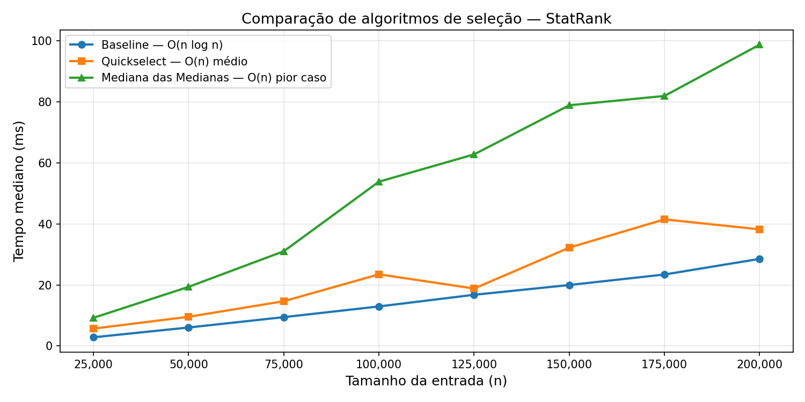

# StatRank

Ferramenta de linha de comando para encontrar o **k-ésimo menor valor** em grandes datasets usando algoritmos de seleção eficientes, com destaque para o algoritmo **Mediana das Medianas**, que garante complexidade linear no pior caso.

Desenvolvido como trabalho prático da disciplina **Projeto de Algoritmos**  módulo Dividir e Conquistar.

---

# Problema Real

Em sistemas que processam grandes volumes de dados, como folhas de pagamento, resultados de exames, registros financeiros e bases governamentais, frequentemente é necessário encontrar percentis, medianas ou o k-ésimo menor valor.

Uma abordagem simples seria ordenar todo o conjunto de dados, porém isso realiza mais trabalho do que o necessário. Algoritmos de seleção permitem encontrar diretamente o elemento desejado com maior eficiência.

Este projeto compara três abordagens:

| Algoritmo                | Complexidade Média | Pior Caso  |
| ------------------------ | ------------------ | ---------- |
| Baseline (sort + índice) | O(n log n)         | O(n log n) |
| Quickselect              | O(n)               | O(n²)      |
| Mediana das Medianas     | O(n)               | O(n)       |

---

# Instalação

Clone o repositório:

```bash
git clone https://github.com/<seu-usuario>/statrank.git
cd statrank
```

Instale o projeto:

```bash
pip install -e .
```

Instale as dependências opcionais para benchmark e testes:

```bash
pip install matplotlib pytest
```

---

# Uso

## Encontrar o k-ésimo menor valor

```bash
python -m statrank.cli data/202601_Remuneracao.csv --k 1000
```

## Calcular um percentil

```bash
python -m statrank.cli data/202601_Remuneracao.csv --percentil 90
```

## Ver resumo estatístico completo

```bash
python -m statrank.cli data/202601_Remuneracao.csv --resumo
```

## Escolher o algoritmo

Baseline:

```bash
python -m statrank.cli data/202601_Remuneracao.csv --percentil 75 --metodo baseline
```

Quickselect:

```bash
python -m statrank.cli data/202601_Remuneracao.csv --percentil 75 --metodo quickselect
```

Mediana das Medianas:

```bash
python -m statrank.cli data/202601_Remuneracao.csv --percentil 75 --metodo mom
```

## Especificar coluna

Listar colunas disponíveis:

```bash
python -m statrank.cli data/202601_Remuneracao.csv --colunas
```

Selecionar uma coluna específica:

```bash
python -m statrank.cli data/202601_Remuneracao.csv --percentil 50 --column REMUNERACAO_BASICA_BRUTA
```

---

# Dataset

Os dados utilizados nos experimentos foram obtidos a partir do Portal da Transparência do Governo Federal.

**Fonte:** https://www.gov.br/transparencia/pt-br

Características do dataset:

* Remunerações de servidores públicos federais
* Arquivo CSV de grande volume
* Utilizado para simular cenários reais de processamento de dados

O arquivo deve ser colocado em:

```text
data/
```

---

# Benchmark

Executar benchmark padrão:

```bash
python benchmark.py
```

Executar benchmark personalizado:

```bash
python benchmark.py --max-n 500000 --repeticoes 5
```

O gráfico será salvo em:

```text
results/benchmark.png
```

---

# Resultados



Os testes foram realizados com entradas aleatórias de até 200.000 elementos.

Resultados observados:

* Baseline (sort + índice): aproximadamente 29 ms para 200.000 elementos
* Quickselect: aproximadamente 38 ms para 200.000 elementos
* Mediana das Medianas: aproximadamente 99 ms para 200.000 elementos

Observa-se que todas as curvas apresentam crescimento aproximadamente linear para os tamanhos avaliados.

Embora a Mediana das Medianas possua garantia teórica de O(n) no pior caso, seu desempenho prático foi inferior ao das demais abordagens. Isso ocorre devido ao alto custo constante do algoritmo, causado pelas etapas extras de agrupamento, cálculo de medianas e chamadas recursivas.

Já a abordagem Baseline apresentou excelente desempenho porque utiliza o algoritmo de ordenação Timsort, implementado em C e altamente otimizado na biblioteca padrão do Python.

O Quickselect apresentou desempenho intermediário. Na prática costuma ser bastante rápido, porém não oferece garantia de desempenho no pior caso.

Resumo:

| Método               | Vantagem Principal                        | Desvantagem Principal                     |
| -------------------- | ----------------------------------------- | ----------------------------------------- |
| Baseline             | Implementação simples e rápida na prática | Ordena todo o conjunto desnecessariamente |
| Quickselect          | Excelente desempenho médio                | Pior caso O(n²)                           |
| Mediana das Medianas | Garantia O(n) no pior caso                | Constante elevada e maior custo prático   |

---

# Algoritmo: Mediana das Medianas

O algoritmo Mediana das Medianas foi proposto para eliminar o pior caso do Quickselect.

Seu funcionamento ocorre em quatro etapas:

1. Divide o vetor em grupos de cinco elementos.
2. Ordena cada grupo e obtém sua mediana.
3. Calcula recursivamente a mediana das medianas.
4. Utiliza essa mediana como pivô para particionar o vetor.

A principal propriedade matemática é que o pivô escolhido garante uma divisão balanceada do problema.

Em cada etapa, pelo menos 30% dos elementos ficam de cada lado do pivô, produzindo a recorrência:

T(n) = T(n/5) + T(7n/10) + O(n)

o que resulta em:

O(n)

mesmo no pior caso.

Essa garantia não existe no Quickselect tradicional, cujo pior caso ocorre quando pivôs ruins são escolhidos repetidamente, levando à complexidade:

O(n²)

---

# Estrutura do Projeto

```text
statrank/
├── statrank/
│   ├── __init__.py
│   ├── algorithms.py
│   ├── loader.py
│   └── cli.py
│
├── tests/
│   └── test_algorithms.py
│
├── data/
├── results/
│
├── benchmark.py
├── setup.py
├── README.md
└── .gitignore
```

Descrição dos módulos:

* algorithms.py: implementação dos algoritmos de seleção
* loader.py: leitura e limpeza dos arquivos CSV
* cli.py: interface de linha de comando
* benchmark.py: geração dos testes de desempenho
* tests/: testes automatizados

---

# Testes

Executar todos os testes:

```bash
python -m pytest tests/ -v
```

---

# Tecnologias Utilizadas

* Python 3
* Matplotlib
* Pytest

---

# Autores

* Eduardo de Almeida Morais

Disciplina: Projeto de Algoritmos

Universidade de Brasília (UnB)
